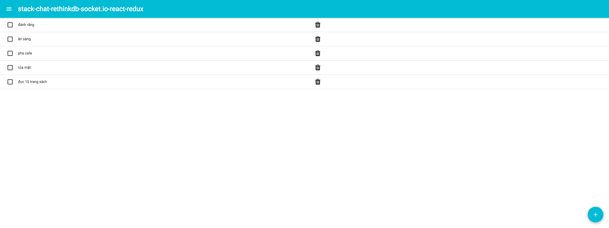
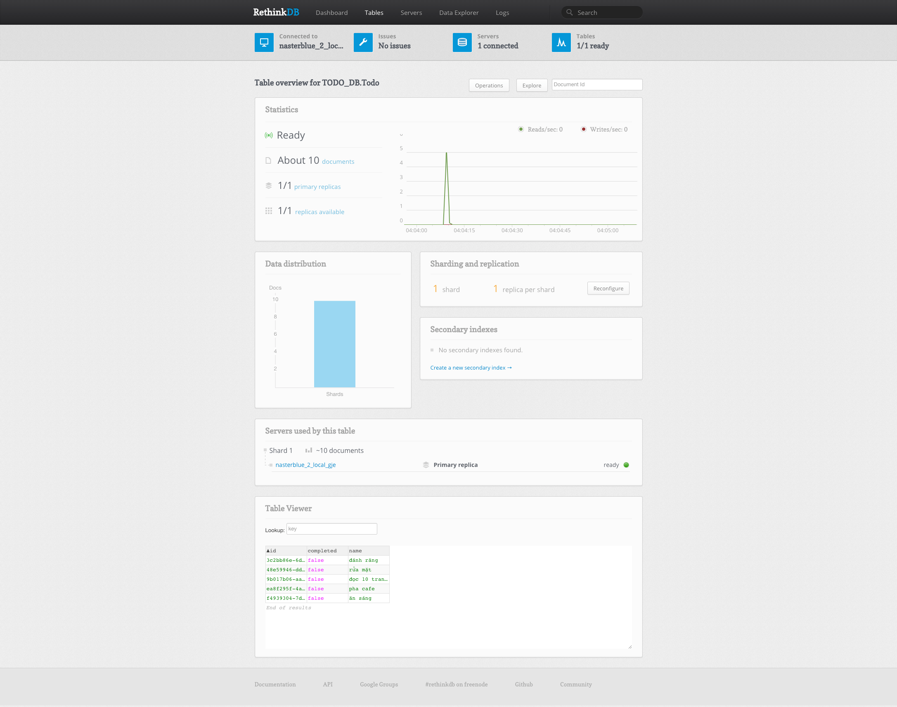

#Frontend Libraries
* React
* Redux
* Socket.IO

#Backend Libraries
* RethinkDB
* Express
* Socket.IO
* [Changefeeds lie at the heart of RethinkDB’s real-time functionality.](https://rethinkdb.com/docs/changefeeds/javascript/)
# Requirement
* [rethinkdb](https://rethinkdb.com/)

#Building the Server Code

* Once RethinkDB is installed , open a BASH terminal and run
```
rethinkdb
```
* Navigate to `http://localhost:8080` in your favorite web browser
* Use the RethinkDB interface to create a Database :
```text
|database | TODO_DB 
|table name | Todo
```

* Build and start
```bash
npm install
npm run build
npm run start
```

* Navigate to http://localhost:9000 !


